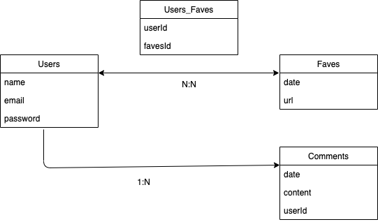

# Astronomy App

Public Site : [The Astronomy App](https://astronomy-picture-app.herokuapp.com/)

## User Story

* As a user, I want to search the Astronomy Picture by the date 
* As a user, I want to sign up to save my favorite pictures
* As a user, I can delete pictures saved in favorite
* As a user, I can add comments under astronmy pictures
* As a user, I can view my comments in profile page and delete it
* As a user, I can change my username

## What it includes

* Sequelize user model / fave model / usersfaves model / comment model
* Settings for PostgreSQL
* Passport and passport-local for authentication
* Sessions to keep user logged in between pages
* Flash messages for errors and successes
* Passwords that are hashed with BCrypt
* EJS Templating and EJS Layouts
* Server route / auth route / profile route

## Resource Credit

* Materialize framework 
* Social media icons from [icons8](https://icons8.com)
* [APOD API](https://api.nasa.gov/) powered by [NASA](https://www.nasa.gov/)
* [APOD documatation](https://github.com/nasa/apod-api)
* [Mars Rover Photos API powered by NASA](https://api.nasa.gov/)

## Models



### User Model

| Column Name | Data Type | Notes |
| --------------- | ------------- | ------------------------------ |
| id | Integer | Serial Primary Key, Auto-generated |
| name | String | Must be provided |
| email | String | Must be unique / used for login |
| password | String | Stored as a hash |
| createdAt | Date | Auto-generated |
| updatedAt | Date | Auto-generated |

### Fave Model

| Column Name | Data Type | Notes |
| --------------- | ------------- | ------------------------------ |
| id | Integer | Serial Primary Key, Auto-generated |
| date | String | Date of the picture user liked |
| url | String | URL of the picture user liked |
| createdAt | Date | Auto-generated |
| updatedAt | Date | Auto-generated |

### UsersFaves Model

Join-table associated with user and fave model, many-to-many relationship

| Column Name | Data Type | Notes |
| --------------- | ------------- | ------------------------------ |
| id | Integer | Serial Primary Key, Auto-generated |
| userId | Integer | User id from user model |
| faveId | Integer | Fave id from fave model |
| createdAt | Date | Auto-generated |
| updatedAt | Date | Auto-generated |

### Comment Model

One-to-Many relationship with user model, one user has many comments

| Column Name | Data Type | Notes |
| --------------- | ------------- | ------------------------------ |
| id | Integer | Serial Primary Key, Auto-generated |
| date | string | Date of the picture to comment on |
| content | text | Content of the comment |
| userId | Integer | User id from user model |
| createdAt | Date | Auto-generated |
| updatedAt | Date | Auto-generated 

## Routes

- Server Route
- Auth Route
- Profile Route

### Server Routes

| Method | Path | Location | Purpose |
| ------ | ---------------- | -------------- | ------------------- |
| GET | / | server.js | Home page |
| GET | /search | server.js | Search page |
| GET | /gallery | server.js | Show random APOD pictures in gallery |
| GET | /mars | server.js | Show mars rover pictures in mars page |
| GET | /detail | server.js | Detail page of each astronomy picture |
| POST | /detail | server.js | Add comments in detail page |
| GET | * | server.js | Error page |

### Auth Routes

| Method | Path | Location | Purpose |
| ------ | ---------------- | -------------- | ------------------- |
| GET | /auth/login | auth.js | Login form |
| GET | /auth/signup | auth.js | Signup form |
| POST | /auth/login | auth.js | Login user |
| POST | /auth/signup | auth.js | Creates user |
| GET | /auth/logout | auth.js | Removes session info |

### Profile Routes

| Method | Path | Location | Purpose |
| ------ | ---------------- | -------------- | ------------------- |
| GET | /profile | profile.js | Show users' collections and comments |
| POST | /profile | profile.js | Add favorite picture to user's collection |
| DELETE | /profile/:id | profile.js | Delete a picture from user's collection |
| DELETE | /profile/comment/:id | profile.js | Delete a comment |
| GET | /profile/edit | profile.js | Edit username form |
| PUT | /profile/edit/:id | profile.js | Update username |

## API Calls

### Get APOD by date ---- Home page & Detail page
```
https://api.nasa.gov/planetary/apod?api_key=${API_KEY}&date=${date}
```

Infomation includes date, explanation, hdurl, url, media type

Some data returns a video, in that case use `<iframe>` instead of ``

Some data doesn't include picture url, in that case show image from `https://http.cat/204` [no content]

### Get a given number of random APOD ---- Home page & Gallery page
```
https://api.nasa.gov/planetary/apod?api_key=${API_KEY}&count=${number}
```

Information returns an array of APOD data

### Get Mars Rover Photos by date ---- Mars page
```
https://api.nasa.gov/mars-photos/api/v1/rovers/curiosity/photos?earth_date=${date}&api_key=${API_KEY}
```

Infomation returns an array of photo objects under the chosen earth_date

The number of photos is not fixed, today and yesterday photos may not upload yet, thus showing photos 7 days ago

data includes img_src, earth_date, camera object

usage: 
```
mars.photos[i].camera.full_name
```

## Things can be improved

- Set a limit for slideshow in case it gets more then 10 pictures, so it won't be too crowded
- Add functionality to allow users to choose pictures from collection for sildeshow
- In detail page, the [Add comment] button outbound at phone screen
- In detail page, add functionailty in comment section to click other username to see their collections

## Author
Jihua (Margaret) Huang
